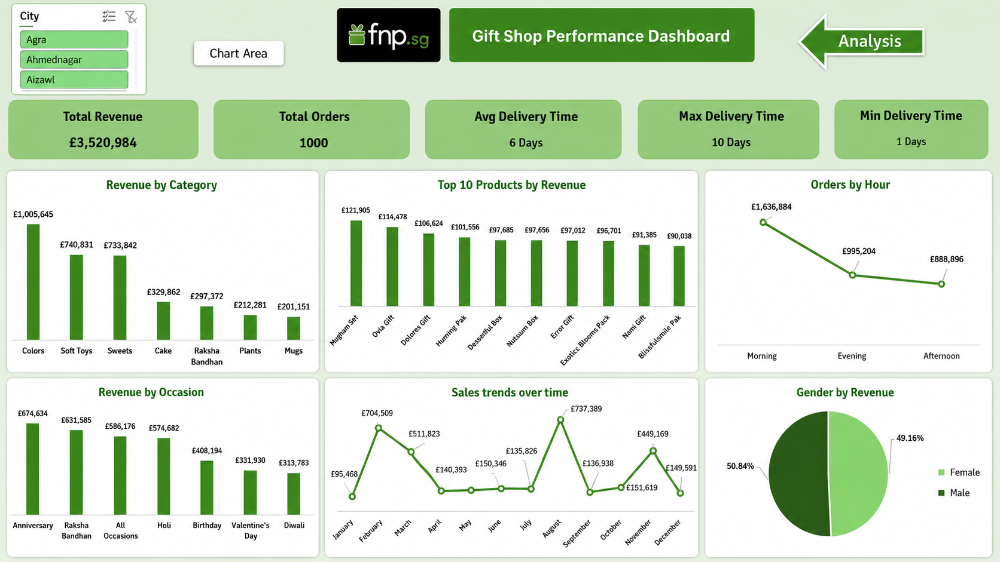

# 🎁 Gift Shop Performance Dashboard


---

## 📊 Dashboard Preview



---

# 📖 Overview

This project presents an interactive Excel dashboard developed to analyze the performance of a gift shop. The dashboard transforms raw transactional data into meaningful business insights using Microsoft Excel, Power Query, Power Pivot, DAX, Pivot Tables, and Pivot Charts.

The objective is to help business stakeholders monitor sales performance, evaluate product performance, understand customer purchasing behavior, and support data-driven decision-making.

---

# 🎯 Business Objectives

This dashboard was built to answer important business questions such as:

- What is the total revenue generated?
- Which product categories generate the highest revenue?
- Which occasions drive the most sales?
- Which cities generate the highest revenue?
- Which products contribute the most revenue?
- What is the sales trend over time?
- Which time of day receives the highest number of orders?
- How efficient is the delivery process?

---

# 📂 Dataset

The project is based on three related datasets.

### Orders

Contains transactional information including:

- Order ID
- Customer ID
- Product ID
- Quantity
- Order Date
- Order Time
- Delivery Date
- Delivery Time
- Location
- Occasion

### Customers

Contains customer information including:

- Customer ID
- Customer Name
- Gender
- City

### Products

Contains product information including:

- Product ID
- Product Name
- Category
- Price

---

# 🔗 Data Model

The dashboard is built using a relational data model in **Power Pivot**.

```
Customers
     │
     │ Customer_ID
     ▼
   Orders
     ▲
     │ Product_ID
     │
 Products
```

Relationships were created between the tables to enable accurate calculations and DAX measures.

---

# 🛠️ Tools & Technologies

- Microsoft Excel
- Power Query
- Power Pivot
- DAX
- Pivot Tables
- Pivot Charts
- Slicers
- Data Modeling

---

# 📊 Dashboard KPIs

- 💰 Total Revenue
- 📦 Total Orders
- 🚚 Average Delivery Time
- ⏱ Maximum Delivery Time
- ⚡ Minimum Delivery Time

---

# 📈 Dashboard Features

- Interactive Slicers
- Dynamic Pivot Charts
- KPI Cards
- Revenue Analysis
- Delivery Performance Analysis
- Product Performance Analysis
- Time-based Order Analysis

---

# ❓ Business Questions Answered

- Which product category generates the highest revenue?
- Which occasion generates the highest revenue?
- Which products generate the highest revenue?
- Which cities generate the highest revenue?
- How does revenue change over time?
- Which time of day receives the highest number of orders?
- What is the average delivery time?

---

# 💡 Key Insights

- Anniversary generated the highest revenue among all occasions.
- Colors and Soft Toys were the best-performing product categories.
- A small number of products contributed a significant portion of total revenue.
- Morning recorded the highest order volume.
- Sales varied across the year, indicating seasonal demand.
- Average delivery time was approximately 6 days.

---

# 🚀 Business Recommendations

### 1. Increase Inventory for High-Demand Occasions

Anniversary and Raksha Bandhan generated the highest revenue. Increasing inventory before these occasions can help prevent stock shortages and maximize sales.

### 2. Focus Marketing on Best-Selling Categories

Invest more in marketing campaigns for high-performing categories such as Colors and Soft Toys to increase revenue.

### 3. Improve Low-Performing Categories

Bundle low-selling products with popular products or introduce promotional offers to increase demand.

### 4. Expand Best-Selling Products

Increase inventory for top-selling products and consider launching similar products.

### 5. Optimize Staffing During Peak Hours

Morning receives the highest number of orders. Increasing staff availability during this period can improve customer service and order processing.

### 6. Improve Delivery Performance

Analyze delayed deliveries and optimize logistics to reduce delivery time and improve customer satisfaction.

### 7. Focus on High-Performing Cities

Increase marketing efforts and delivery capacity in cities that generate the highest revenue.

---

# 📁 Repository Structure

```
gift-store-performance-dashboard/
│
├── data/
│   ├── customers.csv
│   ├── orders.csv
│   └── products.csv
│
├── Dashboard/
│   ├── Dashboard.png
│   └── Gift Store Performance Dashboard.xlsx
│
├── assets/
│
├── README.md
└── LICENSE
```

---

# 👨‍💻 Author

**Mahmoud Said**

## ⭐ If you found this project useful, consider giving it a star!
